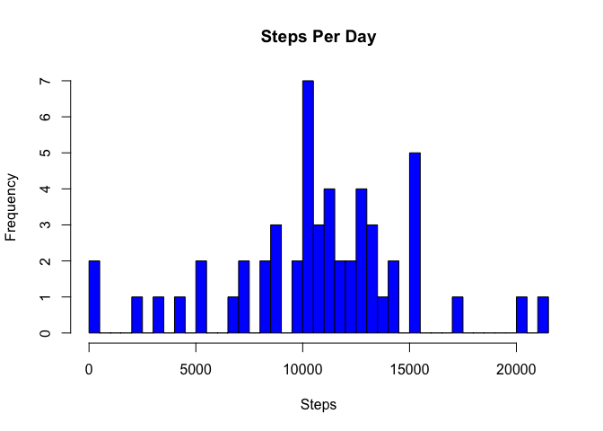
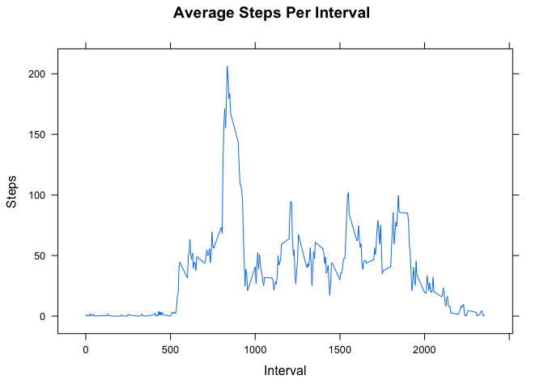
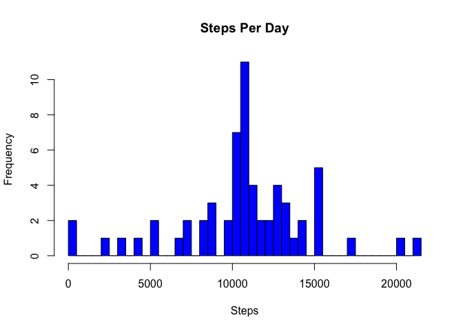

# Reproducible Research: Peer Assessment 1


## Loading and preprocessing the data

Load the downloaded data and convert to a data.table.  Set the **interval** column as a key.


```r
library(data.table)

activity1 <- data.table(read.csv('./data/activity.csv', header=TRUE))
setkey(activity1, interval)
numDays <- length(unique(activity1$date))
```

17568 observations were found in the downloaded data.   
61 unique dates are present.


```r
summary(activity1)
```

```
##      steps                date          interval     
##  Min.   :  0.00   2012-10-01:  288   Min.   :   0.0  
##  1st Qu.:  0.00   2012-10-02:  288   1st Qu.: 588.8  
##  Median :  0.00   2012-10-03:  288   Median :1177.5  
##  Mean   : 37.38   2012-10-04:  288   Mean   :1177.5  
##  3rd Qu.: 12.00   2012-10-05:  288   3rd Qu.:1766.2  
##  Max.   :806.00   2012-10-06:  288   Max.   :2355.0  
##  NA's   :2304     (Other)   :15840
```

***

## What is mean total number of steps taken per day?

Aggregate the activity data by date to sum the number of steps.


```r
stepsPerDay1 <- aggregate(. ~ date, data=activity1, FUN=sum)[,1:2]
hist(stepsPerDay1$steps, breaks=numDays, main="Steps Per Day", xlab="Steps", col="blue")
```

 

```r
meanStepsPerDay1 <- mean(stepsPerDay1$steps)
medianStepsPerDay1 <- median(stepsPerDay1$steps)
```

#### Mean number of steps per day : 10,766.19
#### Median number of steps per day : 10,765

***

## What is the average daily activity pattern?

Aggregate the activity data by interval to find the mean value of the number of steps.


```r
avgStepsPerInterval <- data.table(aggregate(. ~ interval, data=activity1, FUN=mean)[,1:2])
setkey(avgStepsPerInterval, interval)

library(lattice)
xyplot(steps ~ interval, data=avgStepsPerInterval, type='l', xlab="Interval", ylab="Steps", main="Average Steps Per Interval")
```

 

***

## Inputing missing values


```r
numMissingSteps1 <- length(which(is.na(activity1$steps)))
```

2304 observation are missing values for number of steps. Create a duplicate dataset from the original data.  
Set missing step values equal to the mean interval value.


```r
activity2 <- data.table(read.csv('../../data/activity.csv', header=TRUE))
setkey(activity2, interval)
activity2[avgStepsPerInterval, steps := ifelse(is.na(steps), i.steps, steps), nomatch=0]
```

```
##        steps       date interval
##     1:     1 2012-10-01        0
##     2:     0 2012-10-02        0
##     3:     0 2012-10-03        0
##     4:    47 2012-10-04        0
##     5:     0 2012-10-05        0
##    ---                          
## 17564:     0 2012-11-26     2355
## 17565:     0 2012-11-27     2355
## 17566:     0 2012-11-28     2355
## 17567:     0 2012-11-29     2355
## 17568:     1 2012-11-30     2355
```

```r
numMissingSteps2 <- length(which(is.na(activity2$steps)))

stepsPerDay2 <- aggregate(. ~ date, data=activity2, FUN=sum)[,1:2]
hist(stepsPerDay2$steps, breaks=numDays, col="blue")
```

 

```r
meanStepsPerDay2 <- mean(stepsPerDay2$steps)
medianStepsPerDay2 <- median(stepsPerDay2$steps)

pctDiffMeanStepsPerDay <- abs((meanStepsPerDay2 - meanStepsPerDay1) / meanStepsPerDay2) * 100
pctDiffMedStepsPerDay <- abs((medianStepsPerDay2 - medianStepsPerDay1) / medianStepsPerDay2) * 100

hist(stepsPerDay2$steps, breaks=numDays, main="Steps Per Day", xlab="Steps", col="blue")
```

 

#### Mean number of steps per day : 10,749.77 (0.1527 % difference)  
#### Median number of steps per day : 10,641 (1.165 % difference) 

***

## Are there differences in activity patterns between weekdays and weekends?

Create a new factor (day.type) in activity2 signifying whether the date is a weekday or weekend.  
Calculated the mean number of steps per day.type and interval.


```r
activity2$date <- as.Date(activity2$date)
activity2[,day.type := ifelse(weekdays(date) %in% c("Saturday","Sunday"), "weekend","weekday")]
```

```
##        steps       date interval day.type
##     1:     1 2012-10-01        0  weekday
##     2:     0 2012-10-02        0  weekday
##     3:     0 2012-10-03        0  weekday
##     4:    47 2012-10-04        0  weekday
##     5:     0 2012-10-05        0  weekday
##    ---                                   
## 17564:     0 2012-11-26     2355  weekday
## 17565:     0 2012-11-27     2355  weekday
## 17566:     0 2012-11-28     2355  weekday
## 17567:     0 2012-11-29     2355  weekday
## 17568:     1 2012-11-30     2355  weekday
```

```r
library(plyr)
```


